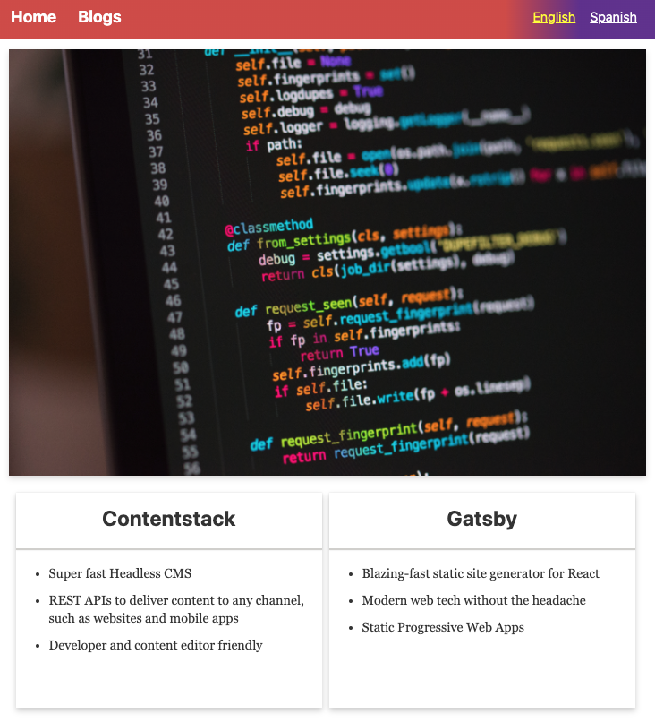
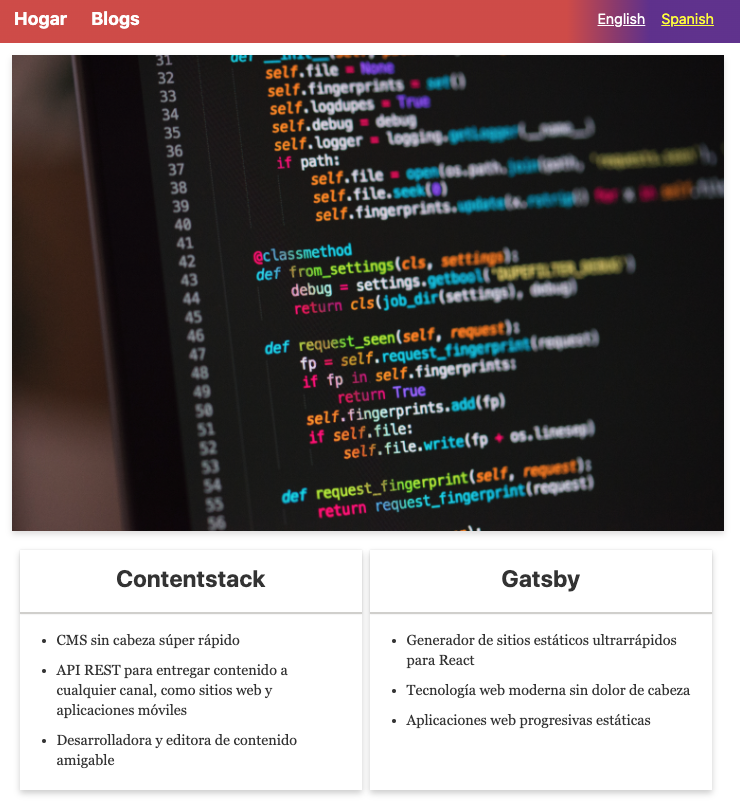

## Contentstack and Gatsby Multilingual Example

**About Contentstack**: Contentstack is a headless CMS with an API-first approach that puts content at the center. It is designed to simplify the process of publication by separating code from content.

**About this project**: This project extends Contentstack's Gatsby Static Site Demo. It requries you to complete the [tutorial to create an app using Gatsby and Contentstack](https://www.contentstack.com/docs/developers/sample-apps/build-a-sample-website-using-gatsby-and-contentstack). After completing the tutorial, add the `Spanish (es)` language to your stack and publish the site's content to the environment configured in `gatsby-config.js`.

Additionally, this sample app is a demo on how to use [Contentstack's gatsby-source-plugin](https://github.com/contentstack/gatsby-source-contentstack).

## Screenshots

Home Page in English:

  
Home Page in Spanish:

## Running the example
1.  Complete the [Gatsby and Contentstack Sample App Tutorial](https://www.contentstack.com/docs/developers/sample-apps/build-a-sample-website-using-gatsby-and-contentstack)
2.  Install the dependencies for the site `npm install`
3.  Run the Gatsby development server `gatsby develop`

## Help
- [Contentstack Documentation](https://www.contentstack.com/docs)
- [Gatsby Documentation](https://www.gatsbyjs.org/docs/)
